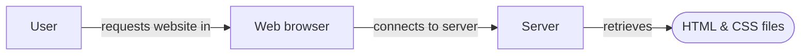

So recently I was talking to a friend (who works with websites a lot) and he said to me

> "I have been looking into web development and want to be able to build a website by myself, any tips on getting started?"

Of course I was glad to help and I do have quite a few websites, articles and whatnot scattered in my bookmarks and notes (and in my head ;)) about this topic.

But all of this was not neatly stacked together in a accessible logical order for a web newbie to understand. And since I have actually received this question more often I thought, "ok why not create a little article to pack this together". Which finally gives me a good excuses to start the blog on my new website YEAY!

")

## Understanding the what

So before I start copy pasting a big list of links to articles and videos created by people who can most probably explain and teach this better than me, let me explain the industry jargon and how to use these links.

First of all, "what exactly are we going to learn?". When learning things it is always a good first step to understand the "what" as well as possible. In most cases this means splitting up the subject in the most basic terms possible. So let's set out with the first question:

> "how do I learn web development?"

The first words of that sentence should be simple enough but let's look at "web development". [As wikipedia states it](https://en.wikipedia.org/wiki/Web_development "Wikipedia article about web development"):

> **Web development** is the work involved in developing a [website](https://en.wikipedia.org/wiki/Website "Website") for the [Internet](https://en.wikipedia.org/wiki/Internet "Internet") ([World Wide Web](https://en.wikipedia.org/wiki/World_Wide_Web "World Wide Web")) or an [intranet](https://en.wikipedia.org/wiki/Intranet "Intranet") (a private network).[\[1\]](https://en.wikipedia.org/wiki/Web_development#cite_note-1) Web development can range from developing a simple single [static page](https://en.wikipedia.org/wiki/Static_web_page "Static web page") of [plain text](https://en.wikipedia.org/wiki/Plain_text "Plain text") to complex web-based [internet applications](https://en.wikipedia.org/wiki/Internet_application "Internet application") (web apps), [electronic businesses](https://en.wikipedia.org/wiki/Electronic_business "Electronic business"), and [social network services](https://en.wikipedia.org/wiki/Social_network_service "Social network service").

As you can probably understand, especially if you read the rest of the article, it can become rather complex. Don't worry we will start with the simplest variant, a static page.

When looking at a static page the following happens when you open a website with static content (like this website :D).

* As a user you type in a [URL](https://en.wikipedia.org/wiki/URL "URL") in the browser (or click a link in Google)
* The browser sends a request to the [URL](https://en.wikipedia.org/wiki/URL "URL") of this website (which is like a home address for the website server)
* The server receives this request and collects the right HTML & CSS files
* And then the server send those files back, which follows the same order but in reverse
* Finally the user sees a (hopefully) nice website page

In the case of dynamic websites this is actually quite similar with only one difference: the HTML & CSS files are not retrieved as files that are saved somewhere on the server but are actually generated on-the-fly. This generating of files is done by following the instructions given by some server-side language. For instance PHP, Python or Java. This allows the website to be much more interactive, like having users log in and create posts on a forum.

This we will save for the next chapter however so let's get back to the static server flow.

Now what does this tell us? If we want to give the user the ability to use our website we need 2 things (assuming the user has a browser).

* a server to serve files
* files to be served

The server part we can skip for now since that is a very technical thing which in most cases is not (directly) a concern for the web developer. Nowadays there are actually a lot of services that can take this entire step out of your hands. Meaning you just deliver your files in some way and the services takes care of the web server part. Especially in the case of static websites this is super simple. A great example and new favorite of mine in this case is [Netlify](https://www.netlify.com/ "Netlify") but I will tell more about that in some other post.

So when we have all that we need to create our content, our HTML & CSS files.

### What are the files a web-server serves?

So I hear you asking, "what are these HTML and CSS files you keep talking about?". Well let me explain. The most important of the two is the HTML file but you actually rarely see those without CSS.

HTML stands for [Hypertext Markup Language](https://en.wikipedia.org/wiki/HTML "HTML") and are just fancy words for text files describing the structure of your web page.

CSS stands for [Cascading Style Sheets]() and also are fancy words for a text file describing the presentation for your web page.

So to visualize this, HTML is like the wooden frame of the house and CSS is the paint. Of course this metaphor does not cover it 100% as you can actually do some styling with HTML and influence the structure with CSS. But this should hold up most of the time and is a good guideline when you are having doubts which of the two to use.

_A small side note to all of this is that although we talk about separate files CSS can actually be used inside a HTML file. But although technically possible and seen all throughout the internet, it is a good practice to create separate CSS files. It makes for clear separation while working with them and actually has some technical uses as well but more about those in future acticles._

Another file type we see a lot but we will not go into is [Javascript](https://en.wikipedia.org/wiki/JavaScript "Javascript"), not to be confused with the server side language Java BTW. This client-side scripting language allows you to do fancy interactive things on your website like folding out a menu bar when you click on it or creating a scrolling image gallery. This is definitely a recommended subject when you have mastered the basics of websites.

### How do I create files to be served?

Well that is easy, you type them! Just open any editor you have and type the right tags to create your HTML & CSS and save them with the extension `.html` and `.css`.

"But I don't know the tags!" you say? No problem you will learn them soon enough!

That finally brings me to my promised link dump. The following are links to tutorials and other resources I have gathered and recommend. Let me know if you like them and of course if you have any tips to improve it!

#### HTML & CSS

* [https://www.freecodecamp.org/learn/responsive-web-design/basic-html-and-html5/](https://www.freecodecamp.org/learn/responsive-web-design/basic-html-and-html5/ "https://www.freecodecamp.org/learn/responsive-web-design/basic-html-and-html5/")

##### Videos:

* [https://www.youtube.com/watch?v=PlxWf493en4](https://www.youtube.com/watch?v=PlxWf493en4 "https://www.youtube.com/watch?v=PlxWf493en4")

##### References & best practices

* [https://developer.mozilla.org/nl/docs/Learn](https://developer.mozilla.org/nl/docs/Learn "https://developer.mozilla.org/nl/docs/Learn")
* [https://developers.google.com/web/fundamentals](https://developers.google.com/web/fundamentals "https://developers.google.com/web/fundamentals")
* [https://htmlreference.io/](https://htmlreference.io/ "https://htmlreference.io/")
* [https://cssreference.io/](https://cssreference.io/ "https://cssreference.io/")
* [https://github.com/hail2u/html-best-practices](https://github.com/hail2u/html-best-practices "https://github.com/hail2u/html-best-practices")

#### Learning platforms

* [https://www.freecodecamp.org](https://www.freecodecamp.org "https://www.freecodecamp.org")
* [https://www.codecademy.com](https://www.freecodecamp.org "https://www.freecodecamp.org")
* [https://www.khanacademy.org/hourofcode](https://www.freecodecamp.org "https://www.freecodecamp.org")

### Going more advanced

#### Javascript

* [https://www.freecodecamp.org/learn/javascript-algorithms-and-data-structures/basic-javascript/](https://www.freecodecamp.org/learn/javascript-algorithms-and-data-structures/basic-javascript/ "https://www.freecodecamp.org/learn/javascript-algorithms-and-data-structures/basic-javascript/")

#### PHP

Instructions the server uses to create the HTML & CSS

* [https://www.codecademy.com/learn/learn-php](https://www.codecademy.com/learn/learn-php "https://www.codecademy.com/learn/learn-php")

##### Videos

* [https://www.youtube.com/watch?v=OK_JCtrrv-c](https://www.youtube.com/watch?v=OK_JCtrrv-c "https://www.youtube.com/watch?v=OK_JCtrrv-c")
* Harvard course: [http://cs75.tv/2010/fall/](http://cs75.tv/2010/fall/ "http://cs75.tv/2010/fall/")

##### References & best practices

* [https://www.php.net/](https://www.php.net/ "https://www.php.net/")
* [https://phptherightway.com/](https://www.php.net/ "https://www.php.net/")